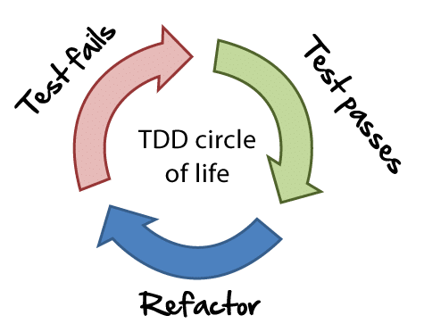
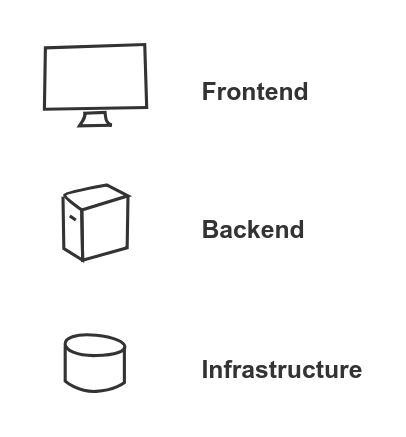
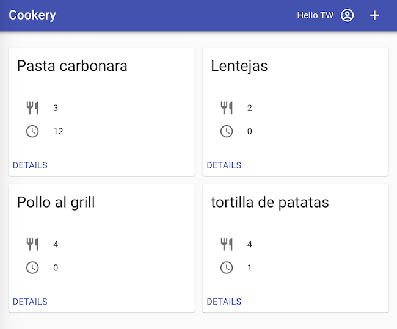
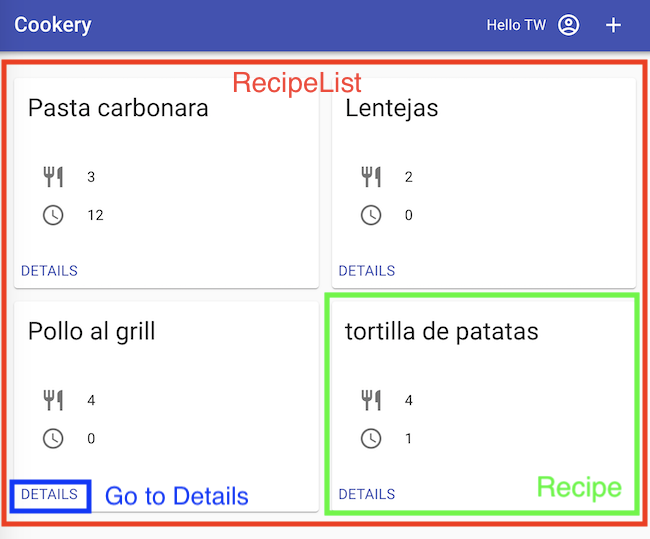
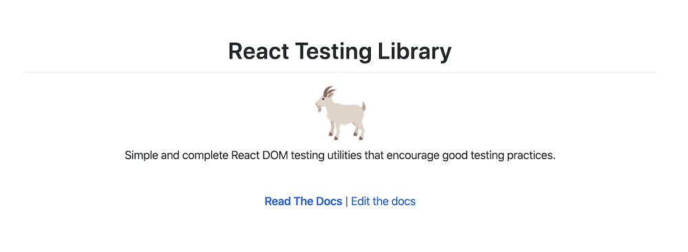
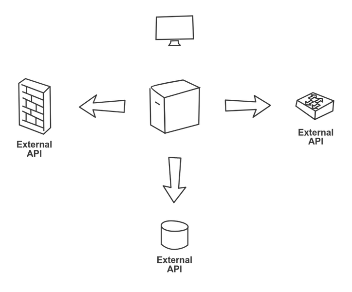
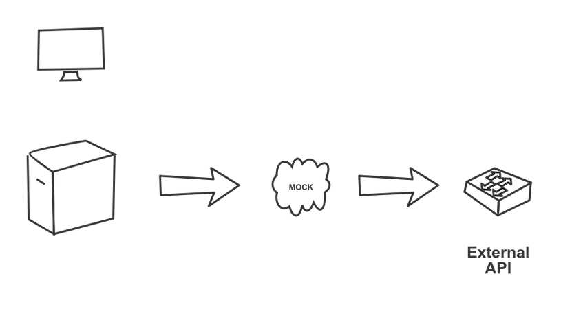
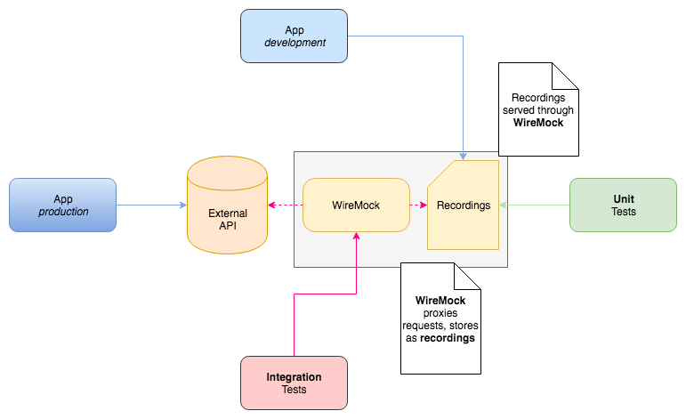

title: TDD against the odds
class: animation-fade
layout: true


<!-- This slide will serve as the base layout for all your slides -->

---

class: impact full-width

.impact-wrapper[
# {{title}}
## Three stories
]

???

- I want to talk about TDD for the next 30 minutes or so. I want to share 3 stories about how I've seen TDD used in our projects

---

class: center middle

## ThoughtWorks  ❤️   Test Driven Development

???

- We love TDD@TW. How can we test this? is one of the most common questions you will hear in our teams

---

class: center middle



???

Write a red test
Make it green
Refactor the code

You probably have heard this many times already

---

class: center middle

## Let's look at an example

---

class: center middle

```kotlin
data class Sum(private val value: Int) {
    operator fun plus(other: Sum): Sum
}
```

???

- let's imagine we can to re-implement summation

--

```kotlin
Sum(3) + Sum(2) // Sum(5)
```

---

class: center middle

```kotlin
@Test
fun `adds two values`() {
    expectThat(Sum(3) + Sum(2))
        .isEqualTo(Sum(5))
}
```

---

class: center middle

```kotlin
@Test
fun `identity property`() {
    expectThat(Sum(3) + Sum(0))
        .isEqualTo(Sum(3))
}
```
---

class: center middle

```kotlin
@Test
fun `associative property`() {
    expectThat(Sum(3) + Sum(2))
        .isEqualTo(Sum(2) + Sum(3))
}
```

---

class: center middle

```kotlin
data class Sum(private val value: Int) {
    operator fun plus(other: Sum): Sum {
        return Sum(value + other.value)
    }
}
```

---

class: center middle

## Reality is messy

???

- Sounds great
- Often in practice, our code is not a neat class with well defined input/output parameters

---

class: center middle



???

- I'm going to show you 3 examples where we used a TDD approach for something that's a bit less standard
- three very different areas

---

class: center middle

### One case study for each


---

class: transition

# Frontend

---

class: center middle

## Frontend = SPA
### These days

---

class: center middle



---

class: center middle

## How do you do TDD in React?

---

class: center middle

.col-8[

]

.col-4[

]

---

class: center middle



---

class: center middle


```typescript
it('renders a recipe list', () => {
* const wrapper = shallow(<RecipeList {...props} />)
})
```

---

class: center middle


```typescript
it('renders a recipe list', () => {
  const wrapper = shallow(<RecipeList {...props} />)
  
* expect(wrapper.find('Recipe').props().toEqual({
*   title: 'Pasta Carbonara'
* }))
})
```
---

class: center middle

## This is not great

---

class: center middle

### kentcdodds.com/blog/why-i-never-use-shallow-rendering

???

- TLDR: 
 - hard to refactor
 - app might be broken and tests green

---

class: center middle



---

class: center middle

> The more your tests resemble the way your software is used, the more confidence they can give you.

---

class: center middle

```typescript
it('renders a recipe list', async () => {
  const { getByTestId, getByText, getAllByText } = fullRender(<App />, {
    route: '/recipes',
  })
})
```

--

```typescript
jest.mock('recipe-list/recipeList.service')
jest.mock('recipe-details/recipeDetails.service')
```

---

class: center middle

```typescript
it('renders a recipe list', async () => {
  const { getByTestId, getByText, getAllByText } = fullRender(<App />, {
    route: '/recipes',
  })

* // Navigate to list of recipes
* await waitForElement(() => getByTestId('recipe-list'))
})
```

---

class: center middle

```typescript
it('renders a recipe list', async () => {
  const { getByTestId, getByText, getAllByText } = fullRender(<App />, {
    route: '/recipes',
  })

  // Navigate to list of recipes
  await waitForElement(() => getByTestId('recipe-list'))

* // Check recipe
* await waitForElement(() => getByText('Pasta Carbonara'))
})
```

---

class: center middle

```typescript
it('renders a recipe list', async () => {
  const { getByTestId, getByText, getAllByText } = fullRender(<App />, {
    route: '/recipes',
  })

  // Navigate to list of recipes
  await waitForElement(() => getByTestId('recipe-list'))

  // Check recipe + Navigate to it
  await waitForElement(() => getByText('Pasta Carbonara'))
* userEvent.click(getAllByText('DETAILS')[0])
* await waitForElement(() => getByText('egg'))
})
```

---

class: center middle

```typescript
it('renders a recipe list', async () => {
  const { getByTestId, getByText, getAllByText } = fullRender(<App />, {
    route: '/recipes',
  })

  // Navigate to list of recipes
  await waitForElement(() => getByTestId('recipe-list'))

  // Check recipe + Navigate to it
  await waitForElement(() => getByText('Pasta Carbonara'))
  userEvent.click(getAllByText('DETAILS')[0])
  await waitForElement(() => getByText('egg'))

* // Go back
* userEvent.click(getByText('Back'))
* await waitForElement(() => getByTestId('recipe-list'))
})
```

---

class: center middle

```console
PASS  src/App.test.tsx
  App
    ✓ renders without crashing (111ms)
    ✓ renders new recipe form (107ms)
    ✓ renders a recipe list (148ms)
    ✓ renders recipe details (62ms)
    ✓ redirects to recipes list (39ms)

Test Suites: 1 passed, 1 total
Tests:       5 passed, 5 total
Snapshots:   0 total
Time:        5.534s, estimated 10s
Ran all test suites related to changed files.

Watch Usage: Press w to show more.
```

---

class: center middle

## Closer to integration tests than to unit tests

---

class: center middle

## But more meaningful results

---

class: transition

# Backend

---

class: center middle



---

class: center middle

## Consumer Driven Contract Testing



---

class: center middle

## Only works if both parties can fulfill the contract as part of CI/CD

---

class: center middle

## Alternative
### Recordings

---

class: center middle


---

class: center middle



---

class: center middle

## Workflow

---

class: center middle

## Write basic API client that makes a call

---

class: center middle

```kotlin
@Component
class JsonPlaceholder {
    @Autowired
    lateinit var template: RestTemplate

    fun todos(): JsonNode {
        val response = template.exchange(
                "/todos",
                HttpMethod.GET,
                null,
                JsonNode::class.java)
        return response.body
    }
}
```

---

class: center middle

## Write integration test that calls the real endpoint and stores the result

---

class: center middle

```kotlin
@Category(IntegrationTest::class)
@RunWith(SpringRunner::class)
@SpringBootTest
class JsonPlaceholderIntegrationTest : RecordingTest() {
    public override fun recordingServerUrl(): String {
        return "https://jsonplaceholder.typicode.com"
    }

    @Autowired
    lateinit var subject: JsonPlaceholder

    @Test
    fun todos() {
        subject.todos()
    }
}
```

---

class: center middle

## Use recording in unit test and refine call

---

class: center middle

```kotlin
@RunWith(SpringRunner::class)
@SpringBootTest
class JsonPlaceholderTest : RecordedTest() {
    @Autowired
    lateinit var subject: JsonPlaceholder

    @Test
    fun todos() {
        expectThat(subject.todos())
            .isNotEmpty()
    }
}
```

---

class: center middle

```console
usage: ./go <goal>

    goal:

    test-unit                -- Run unit tests
    test-integration         -- Run integration tests

    refresh-recordings       -- Recreate recordings
```

---

class: center middle

### hceris.com/recording-apis-with-wiremock

---

class: transition

# Infrastructure

---

class: center middle

## For us, infrastructure mostly means cloud infrastructure provisioned with code

---

class: center middle

## That, however, is a very broad topic

---

class: center middle


---

class: center middle

## TDD for  containers

---

class: center middle


.bottom-right[
serverspec.org
]

---

class: middle

## Basic setup

```ruby
require 'serverspec'
require 'docker'
require 'rspec/wait'

set :backend, :docker
set :docker_image, 'example-openjdk'

RSpec.configure do |config|
  config.wait_timeout = 60 # seconds
end
```

---

class: middle

### OS Version

```ruby
describe file('/etc/alpine-release') do
  its(:content) { is_expected.to match(/3.8/) }
end
```

---

class: middle

### Java Version

```ruby
describe command('java -version') do
  its(:stderr) { is_expected.to match(/1.8/) }
end
```

---

class: center middle

```Dockerfile
FROM openjdk:8-jre-alpine3.8
```

---

class: middle

### JAR

```ruby
describe file('gs-rest-service.jar') do
  it { is_expected.to be_file }
end
```

---

class: center middle

```Dockerfile
FROM openjdk:8-jre-alpine3.8

WORKDIR /app
ENV VERSION="0.1.0"

*COPY build/libs/gs-rest-service-${VERSION}.jar gs-rest-service.jar
```
---

class: center middle

## This is not just about static checks

---

class: center middle

## Runtime checks are also possible

---

class: middle

### App is running

```ruby
describe process('java') do
  it { is_expected.to be_running }
  its(:args) { is_expected.to contain('gs-rest-service.jar') }
end
```

---

class: middle

### Bound to right port

```ruby
describe 'listens to correct port' do
  it { wait_for(port(8080)).to be_listening.with('tcp') }
end
```

---

class: center middle

```Dockerfile
FROM openjdk:8-jre-alpine3.8

WORKDIR /app
*EXPOSE 8080
ENV VERSION="0.1.0"

COPY build/libs/gs-rest-service-${VERSION}.jar gs-rest-service.jar

*CMD ["java", "-jar", "gs-rest-service.jar"]
```

---

class: middle

### Not running under root

```ruby
describe process('java') do
  its(:user) { is_expected.to eq('runner') }
end
```

---

class: center middle

```Dockerfile
FROM openjdk:8-jre-alpine3.8

WORKDIR /app
EXPOSE 8080
ENV VERSION="0.1.0"

COPY build/libs/gs-rest-service-${VERSION}.jar gs-rest-service.jar

*RUN adduser -D runner
*USER runner

CMD ["java", "-jar", "gs-rest-service.jar"]
```

---

class: center middle

```console
rspec spec/container_spec.rb
Randomized with seed 61858
.......

Top 7 slowest examples (12.86 seconds, 99.9% of total time):
  Application Container java listens to correct port should be listening with tcp
    7.82 seconds ./spec/container_spec.rb:20
  Application Container java Process "java" should be running
    4.14 seconds ./spec/container_spec.rb:14
  Application Container java Command "java -version" stderr should match /1.8.0_181/
    0.3948 seconds ./spec/container_spec.rb:10
  Application Container java Process "java" args should contain "gs-rest-service.jar"
    0.15328 seconds ./spec/container_spec.rb:15
  (more output ...)

Finished in 12.87 seconds (files took 1.69 seconds to load)
7 examples, 0 failures
```

---

class: center middle

### github.com/sirech/talks/blob/master/2019-01-tw-tdd_containers.pdf

---

class: transition

# Conclusion

---

class: center middle

## TDD can be used in situations you didn't think about

---

class: center middle

## Get creative

---

class: center middle

## Don't get stuck at the definition of a *Unit Test*

---

class: transition

## Mario Fernandez
 
 **Thought**Works

---
